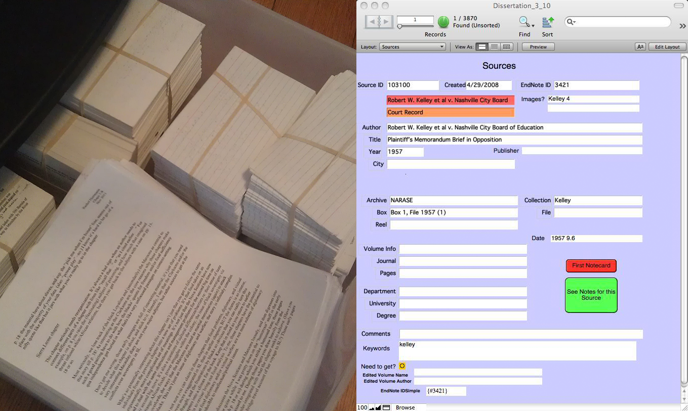

## The problem for historians

<!--
- Historical research involves finding archives with collections of relevant primary documents.
- Sifting through collections, you describe and interpret the content of documents.
- While writing, you re-describe and re-interpret those documents.
- Individuals often craft a system that works for them out of more general purpose tools (e.g., Zotero, Microsoft Word, Evernote).
- Some historians have used relational databases for research within FileMaker Pro (e.g., Scribe) or Microsoft Access.
- Still, no digital tool currently exists for the
http://writinghistory.trincoll.edu/wp-content/uploads/2011/09/SourceLayout.jpg
-->

## Towards a tool for the tech-savvy historian

<!--
- Rather than a relational database that requires a clearly defined structure, use a document-oriented database that is **semi-structured**.
- Build a desktop app with **web technologies** like Javascript, HTML, and CSS.
- Bootstrap new project with a data schema and templates but provide **the flexbility** to alter both.
- Document content and descriptions can be **searched** with **fuzzy** matching and **faceted** navigation. 
-->